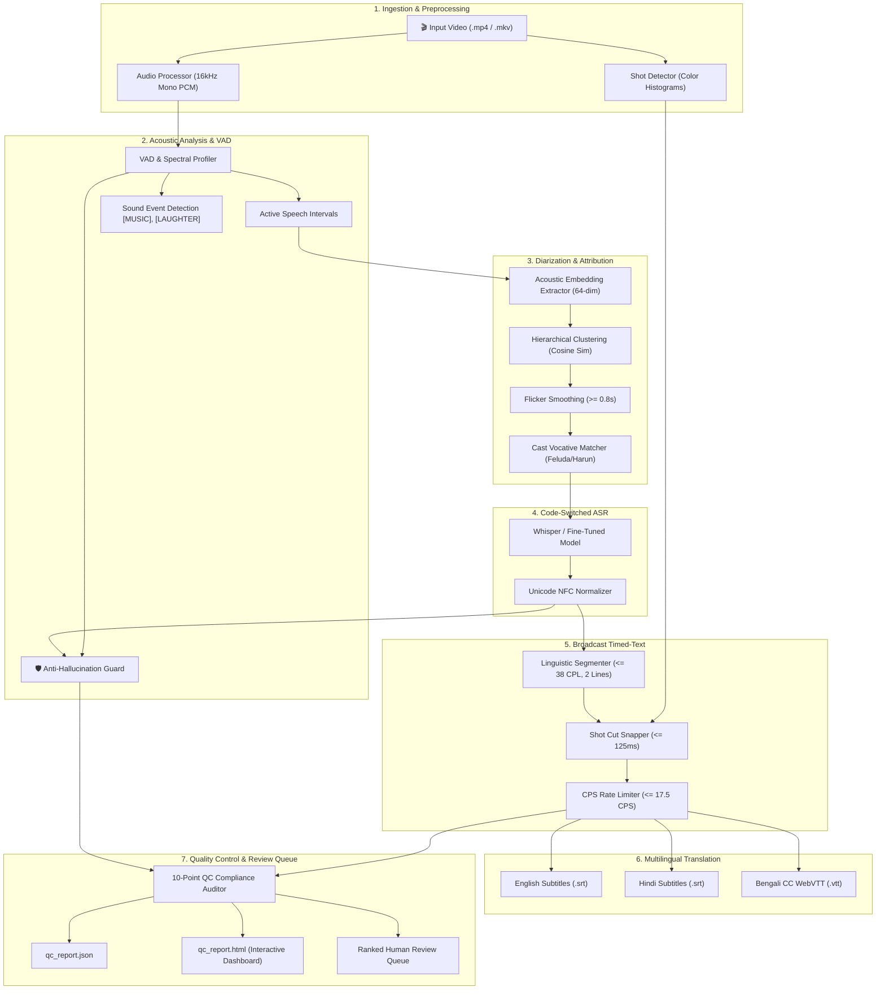

# 🎬 Hoichoi OTT AI Engineering Suite
### Bengali-English Code-Switched ASR & Automated Broadcast Captioning Pipeline

[](https://www.python.org/)
[](https://pytorch.org/)
[](https://huggingface.co/)
[](LICENSE)

An enterprise-grade, broadcast-compliant speech and language suite engineered for **Hoichoi OTT platform**. Comprises two cleanly separated production tracks:

1. **Problem 1 (Speech Recognition)**: Bengali-English Code-Switched ASR via Multi-Tier LoRA (Path A) and PolyWhisper Mixture-of-LoRA-Experts (Path B).
2. **Problem 2 (Media Localisation)**: Automated Broadcast-Quality Closed-Captioning & Subtitling Pipeline with Persistent Speaker Diarization, Sound Event Detection, Multilingual Translation (EN/HI), and a 10-Point Quality Control (QC) Engine with a Ranked Review Queue.

---

## 🏛️ Pipeline Architecture (Problem 2)



---

## 💎 The 3 Pillars (Problem 2)

| Pillar | Engineering Mandate | Implementation Guarantee |
| :--- | :--- | :--- |
| **Recognition** | Exact transcript of spoken Bengali with code-switched English (*"ওর office-এ meeting আছে"*) | Unicode NFC normalization, LoRA / MoLE adapter integration, Whisper cross-attention offsets. |
| **Attribution** | Who spoke and when; zero identity swaps across entire runtime | 64-dim spectral embeddings, hierarchical agglomerative clustering, cast registry vocative matching. |
| **Presentation** | Human screen readability; Netflix / BBC timed-text adherence | Reading speed <= 17.5 CPS, line length <= 38 CPL, <= 2 lines/cue, min gap >= 80 ms, visual shot snapping. |

---

## 🛡️ Anti-Hallucination Defense (The Toughest Test)

Whisper models characteristically hallucinate phantom loops (*"Thank you", "Subscribe"*) over silence or background music. Our multi-signal defense guarantees **zero unflagged hallucinations leak into production**:
1. **VAD Energy & Flatness**: If RMS energy < -45 dBFS or spectral flatness indicates tonal music drone, Whisper text generation is suppressed.
2. **Compression Ratio**: Zlib compression ratio > 2.2 flags repetitive loop hallucinations.
3. **Internal Certainty**: Whisper no_speech_prob > 0.55 or avg_logprob < -1.15 triggers immediate warning.
4. **Auto-Remediation**: Replaces silence/music hallucinations with closed-caption sound events ([MUSIC PLAYING], [SILENCE]) and flags them at **Rank 1** in the **Ranked Human Review Queue**.

---

## 📂 Repository Architecture (Strictly Separated Tracks)

```
hoichoi/
├── pyproject.toml                     # Python packaging configuration
├── requirements.txt                   # Production dependencies
├── README.md                          # Master documentation
├── brands.json                        # Contextual ad brand catalogue & keywords
│
├── src/                               # 🎯 Problem 1: Code-Switched ASR Scripts
│   ├── 01_data_prep.py                # Dataset extraction & tier partitioning
│   ├── 02_train_adapter.py            # LoRA fine-tuning on Whisper
│   ├── 03_merge_adapters.py           # Weighted parameter averaging merge
│   ├── 04_evaluate.py                 # Benchmarking WER against Whisper base
│   └── 05_integrate.py                # GatedASR inference engine
│
├── notebooks/                         # 🎯 Problem 1: Colab Notebooks
│   ├── Notebook_1_DataPrep.ipynb      # Path A: Data Prep
│   ├── Notebook_2_Train_High.ipynb    # Path A: High-density LoRA
│   ├── Notebook_3_Train_Mid.ipynb     # Path A: Mid-density LoRA
│   ├── Notebook_4_Train_Base.ipynb    # Path A: Base-density LoRA
│   ├── Notebook_5_Merge.ipynb         # Path A: Adapter Merge
│   ├── Notebook_6_Evaluate.ipynb      # Path A: Evaluation
│   ├── Notebook_B1_DataPrep.ipynb     # Path B: PolyWhisper MoLE Data Prep
│   ├── Notebook_B2_Train_Bengali_Expert.ipynb  # Path B: Bengali Expert
│   ├── Notebook_B3_Train_English_Expert.ipynb  # Path B: English Expert
│   ├── Notebook_B4_Train_Router.ipynb          # Path B: MoLE Token Router
│   └── Notebook_B5_Evaluate_Compare.ipynb      # Path B: Benchmark & Ad Cue Matching
│
├── problem_2_caption_diarization/     # 🎯 Problem 2: Subtitle & Diarization Suite
│   ├── README.md                      # Problem 2 architecture & guide
│   ├── src/                           # Problem 2 pipeline modules
│   │   ├── __init__.py                # Package exports
│   │   ├── video_audio.py             # 16kHz audio extraction & visual shot cuts
│   │   ├── vad_and_sed.py             # VAD, sound events & anti-hallucination guard
│   │   ├── diarization.py             # Speaker clustering & vocative cast matcher
│   │   ├── timed_text.py              # Broadcast CPS/CPL formatter (VTT / SRT)
│   │   ├── translation.py             # Multilingual subtitle translator (EN / HI)
│   │   ├── qc_engine.py               # 10-point QC audit & ranked review queue
│   │   └── pipeline.py                # End-to-end pipeline orchestrator & CLI
│   ├── configs/                       # Broadcast & QC configurations
│   │   ├── timed_text.yaml            # Netflix / BBC / Hoichoi timed-text specs
│   │   ├── qc_policy.yaml             # QC severity thresholds & hallucination defense
│   │   └── cast_registry.yaml         # Hoichoi series cast lists & aliases
│   ├── notebooks/                     # Problem 2 Interactive Notebook
│   │   └── Problem2_Caption_Diarization_Pipeline.ipynb
│   └── deliverables/                  # Generated VTT, SRT, JSON & HTML QC reports
│
└── data/                              # Data & Assets
    ├── raw_videos/                    # Hoichoi video clips (feluda.mp4, etc.)
    └── train_all.csv                  # MUCS code-switched dataset splits
```

---

## 🚀 Quickstart & Execution

### Running Problem 1 (Code-Switched ASR)
- Open notebooks in `notebooks/` on Google Colab for Path A (Notebooks 1-6) or Path B PolyWhisper MoLE (Notebooks B1-B5).

### Running Problem 2 (Subtitle & Diarization Pipeline)
- Run via CLI:
  ```bash
  python -m problem_2_caption_diarization.src.pipeline --video data/raw_videos/feluda.mp4 --outdir deliverables
  ```
- Or open `problem_2_caption_diarization/notebooks/Problem2_Caption_Diarization_Pipeline.ipynb` on Google Colab for full interactive execution and live QC Dashboard visualization!

# vvd_Asir
